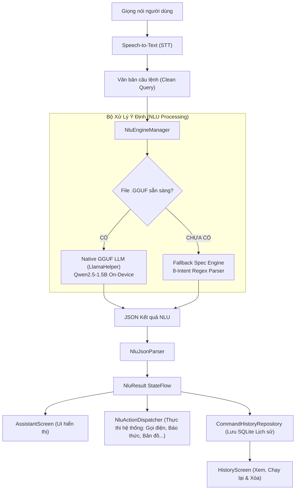

# 🎙️ ViDroidCall - Trợ Lý Giọng Nói Tiếng Việt & On-Device AI NLU

<p align="center">
  
</p>

<p align="center">
  <b>Trợ lý ảo ra lệnh giọng nói tiếng Việt thông minh, tích hợp mô hình AI NLU (Natural Language Understanding) xử lý Offline On-Device, giao diện Jetpack Compose trực quan, dễ dùng cho mọi lứa tuổi và người cao tuổi.</b>
</p>

<p align="center">
  
  
  
  
  
  
  
</p>

---

## 📖 Giới Thiệu (Overview)

**ViDroidCall** là ứng dụng trợ lý điều khiển điện thoại bằng giọng nói tiếng Việt thế hệ mới. Ứng dụng kết hợp giữa công nghệ nhận diện giọng nói thời gian thực (**Speech-to-Text**) và bộ xử lý ngôn ngữ tự nhiên **NLU AI chạy On-Device (GGUF Offline)**, cho phép người dùng điều khiển các chức năng trên điện thoại mà không cần chạm tay và không phụ thuộc vào kết nối mạng.

Giao diện được thiết kế theo ngôn ngữ **Material 3** tối giản, trực diện, cỡ chữ lớn và có khả năng tùy biến kích thước linh hoạt, đặc biệt thân thiện với **người lớn tuổi**.

---

## ✨ Tính Năng Nổi Bật (Key Features)

### 1. 🤖 Động Cơ AI NLU Kép (Dual-Engine NLU Architecture)
* **Native Offline GGUF Engine**: Tự động phát hiện và nạp mô hình ngôn ngữ lớn (LLM - *Qwen2.5-1.5B-Instruct-Q4_K_M*) trong bộ nhớ máy, chạy suy luận hoàn toàn ngoại tuyến qua thư viện `LlamaHelper` (llama.cpp C++ JNI).
* **Fallback Spec Simulator**: Bộ phân tích quy tắc (Rule-based NLU) tuân thủ 100% đặc tả 8 Intent chuẩn, giúp ứng dụng luôn phản hồi tức thì ngay cả khi thiết bị chưa tải file mô hình nặng.
* **Huy hiệu trạng thái AI trực quan**: Hiển thị rõ ràng tình trạng mô hình (`Trợ lý AI ngoại tuyến: Sẵn sàng`, `Trợ lý AI: Sẵn sàng nhận lệnh`, `Đang tải`) bằng tiếng Việt dễ hiểu.

### 2. ⚡ 8 Nhóm Ý Định & Hành Động Chuẩn (Standard Intents)
| Intent | Mô Tả | Tham Số Trích Xuất |
| :--- | :--- | :--- |
| `call_contact` | Gọi điện thoại / Cuộc gọi khẩn cấp (113, 114, 115) | `contact` |
| `send_sms` | Soạn và gửi tin nhắn SMS | `contact`, `message` |
| `set_alarm` | Cài đặt chuông báo thức | `hour`, `minute`, `label` |
| `set_timer` | Hẹn giờ đếm ngược | `duration`, `unit`, `label` |
| `open_map` | Mở bản đồ / Chỉ đường điểm đến | `destination` |
| `open_app` | Khởi chạy ứng dụng cài sẵn | `app_name` |
| `clarify` | Yêu cầu người dùng bổ sung thông tin khi thiếu dữ liệu | `missing` |
| `unsupported`| Phản hồi khi câu lệnh nằm ngoài phạm vi | — |

### 3. 👓 Thân Thiện Với Người Cao Tuổi & Trợ Năng (Accessibility & Senior Friendly)
* **Cài đặt cỡ chữ dạng thanh trượt (Font Size Slider)**: Tùy chỉnh tỷ lệ chữ linh hoạt (`85%` đến `135%`) với 4 nấc chọn nhanh (`Nhỏ` • `Vừa` • `Lớn` • `Rất lớn`).
* **Co giãn toàn diện thời gian thực**: Sử dụng `CompositionLocalProvider(LocalDensity)` giúp thay đổi kích thước toàn bộ văn bản trên tất cả các màn hình ngay lập tức.
* **Giao diện Full-Screen trực diện**: Nút Micro trung tâm cực lớn (126dp), vòng sóng âm động lan tỏa, thẻ hiển thị giọng nói to rõ nét (20sp Bold).

### 4. 📜 Quản Lý Lịch Sử Câu Lệnh Ngoại Tuyến (Offline History & Clear All)
* **Lưu trữ SQLite nội bộ**: Tự động lưu mọi câu lệnh giọng nói, phân loại theo Intent (`Cuộc gọi`, `Tin nhắn`, `Báo thức`, `Hẹn giờ`, `Bản đồ`, `Ứng dụng`), thời gian thực thi và trạng thái.
* **Thực thi lại nhanh (Rerun Action)**: Nhấn nút Play trên thẻ lịch sử để ra lệnh lại ngay lập tức mà không cần nói lại.
* **Xóa linh hoạt**: Hỗ trợ xóa từng mục đơn lẻ hoặc **Xóa toàn bộ lịch sử (Clear All)** kèm hộp thoại xác nhận an toàn.
* **Empty State**: Trạng thái rỗng trực quan khi chưa có câu lệnh hoặc sau khi xóa sạch.

### 5. 🎨 Quản Lý Giao Diện & Theme Động (Jetpack DataStore)
* Hỗ trợ 3 chế độ hiển thị: **Sáng (Light)**, **Tối (Dark - tiết kiệm pin)** và **Theo hệ thống (System)**.
* **Custom Bottom Navigation Bar**: Thiết kế đường cắt notch mềm mại với Logo App nổi bật ở trung tâm, loại bỏ trùng lặp biểu tượng và tăng nhận diện thương hiệu.

---

## 🏗️ Kiến Trúc Hệ Thống (System Architecture)



---

## 📁 Cấu Trúc Thư Mục (Project Structure)

```text
com.example.ViDroidCall_Studio/
│
├── MainActivity.kt                      # Activity gốc, áp dụng Theme và Font Scale toàn cục
│
├── data/
│   ├── local/
│   │   ├── history/
│   │   │   ├── CommandHistoryDatabaseHelper.kt # SQLite OpenHelper quản lý bảng lịch sử
│   │   │   └── CommandHistoryRepository.kt     # Repository CRUD và reactive Flow
│   │   ├── FontSizePreferences.kt       # Quản lý lưu trữ tỷ lệ Cỡ chữ vào DataStore
│   │   ├── OnboardingPreferences.kt     # Lưu trạng thái hoàn thành Onboarding
│   │   └── ThemePreferences.kt          # Quản lý cấu hình Theme (Light / Dark / System)
│   │
│   ├── model/
│   │   ├── NluModels.kt                 # Data classes cấu trúc Intent, Arguments, Risk Level
│   │   └── NluJsonParser.kt             # Bộ phân tích cú pháp JSON an toàn
│   │
│   └── nlu/
│       ├── NluEngineManager.kt          # Bộ điều phối NLU kép (Native LLM + Fallback)
│       ├── NluActionDispatcher.kt       # Thực thi Intent gọi điện, SMS, báo thức, map...
│       └── NluConstants.kt              # ChatML Prompt Template & Cấu hình AI
│
├── feature/
│   ├── assistant/
│   │   └── AssistantScreen.kt           # Màn hình Trợ lý Micro Full-screen & Thẻ NLU
│   ├── history/
│   │   ├── HistoryScreen.kt             # Màn hình Lịch sử câu lệnh đã thực hiện
│   │   └── model/
│   │       └── CommandHistoryItem.kt    # Model dữ liệu lịch sử
│   ├── home/
│   │   └── HomeScreen.kt                # Màn hình chính điều phối các tab và STT
│   ├── onboarding/
│   │   └── OnbroadingScreen.kt          # Màn hình hướng dẫn 3 bước cho người dùng mới
│   ├── settings/
│   │   ├── SettingsScreen.kt            # Cài đặt tổng quan
│   │   ├── FontSizeSettingsScreen.kt    # Màn hình thanh trượt chỉnh cỡ chữ & Xem trước
│   │   └── ThemeSelectionScreen.kt      # Màn hình chọn Theme Sáng / Tối
│   └── speech/
│       ├── RememberSpeechToText.kt      # Compose wrapper cho SpeechRecognizer
│       └── SpeechToTextManager.kt       # Quản lý Audio Record & Speech Recognition
│
├── navigation/
│   ├── AppNavHost.kt                    # Điều hướng Onboarding ↔ Home
│   ├── AppRoot.kt                       # Kiểm tra trạng thái lần đầu khởi chạy
│   └── AppRoute.kt                      # Định nghĩa các Route
│
└── ui/
    ├── component/
    │   ├── CustomBottomMenuBar.kt       # Thanh Bottom Bar tùy biến với Logo App trung tâm
    │   └── BounceClickModifier.kt       # Hiệu ứng chạm phản hồi xúc giác
    └── theme/
        ├── Color.kt                     # Bảng màu thương hiệu & hệ thống
        ├── Shape.kt                     # Cấu hình bo góc hình học
        ├── Theme.kt                     # ViDroidCallTheme hỗ trợ Dynamic Font Scale
        └── Type.kt                      # Typography chuẩn Material 3
```

---

## 🛠️ Công Nghệ Sử Dụng (Tech Stack)

* **Ngôn ngữ**: [Kotlin 2.0+](https://kotlinlang.org/)
* **Giao diện**: [Jetpack Compose](https://developer.android.com/jetpack/compose) & [Material Design 3](https://m3.material.io/)
* **Package**: `com.example.ViDroidCall_Studio`
* **Kiến trúc**: MVI / MVVM với Kotlin Coroutines & StateFlow
* **Xử lý AI On-Device**: [Llama.cpp](https://github.com/ggerganov/llama.cpp) / `LlamaHelper` (Chạy mô hình GGUF trực tiếp trên CPU/NPU thiết bị)
* **Lưu trữ dữ liệu**: [Jetpack DataStore Preferences](https://developer.android.com/topic/libraries/architecture/datastore)
* **Nhận dạng giọng nói**: Android `SpeechRecognizer` API
* **Hoạt họa (Animations)**: Compose Animation (Spring Physics, Infinite Transition, GraphicsLayer)

---

## 🚀 Hướng Dẫn Cài Đặt & Chạy (Getting Started)

### 1. Yêu cầu môi trường
* **Android Studio**: Ladybug / Koala hoặc mới hơn
* **JDK**: Java 17
* **Android SDK**: Min SDK 26 (Android 8.0) | Target SDK 36 | Compile SDK 37.1

### 2. Biên dịch dự án
```bash
# 1. Clone repository
git clone https://github.com/tuanhdevvn/ViDroidCall-Studio.git
cd ViDroidCall-Studio

# 2. Biên dịch APK Debug
./gradlew assembleDebug
```

### 3. Cài đặt mô hình AI GGUF (Tùy chọn)
Để trải nghiệm chế độ **AI Offline On-Device thực thụ**:
1. Tải file mô hình `qwen2.5-1.5b-instruct-q4_k_m.gguf` (hoặc mô hình GGUF tương thích).
2. Chép file vào thư mục `/sdcard/Download/` hoặc `/sdcard/Documents/` trên điện thoại/máy ảo.
3. Mở app **ViDroidCall**, hệ thống sẽ tự động phát hiện và chuyển sang trạng thái: **`Trợ lý AI ngoại tuyến: Sẵn sàng`**.

---

## 📄 Bản Quyền (License)

Dự án được xây dựng và phát triển bởi **Tuấn Anh** (@tuanhdevvn). Mọi quyền được bảo lưu.
