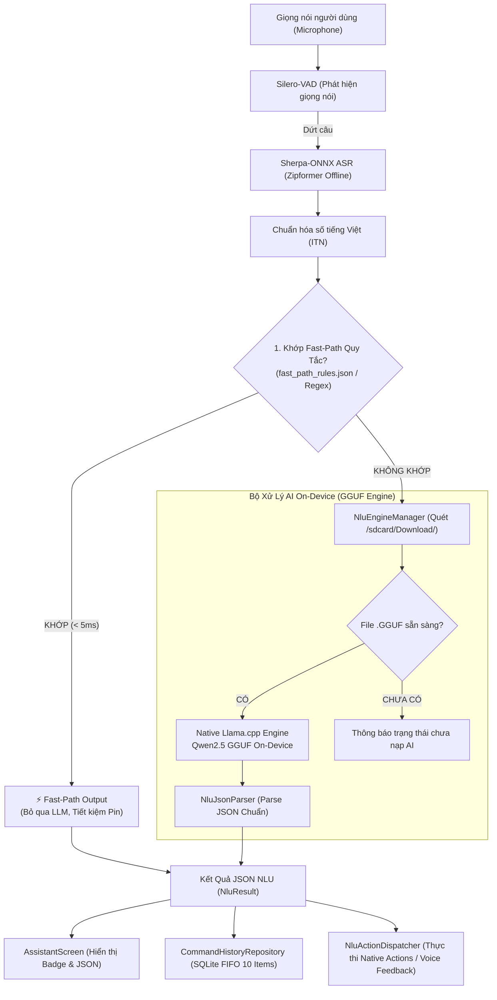

# 🎙️ ViDroidCall Studio - Trợ Lý Giọng Nói Tiếng Việt & Hybrid On-Device NLU

<p align="center">
  
</p>

<p align="center">
  <b>Trợ lý ảo điều khiển giọng nói tiếng Việt thông minh với kiến trúc Hybrid NLU: Bộ quy tắc Fast-Path phản hồi tức thì (< 5ms) kết hợp mô hình AI On-Device (GGUF Llama.cpp) & nhận diện giọng nói Sherpa-ONNX chạy 100% ngoại tuyến, giao diện Jetpack Compose trực quan, tối ưu cho mọi lứa tuổi và người cao tuổi.</b>
</p>

<p align="center">
  
  
  
  
  
  
  
  
  <a href="LICENSE"></a>
</p>

---

## 📖 Giới Thiệu (Overview)

**ViDroidCall Studio** là ứng dụng trợ lý giọng nói tiếng Việt thế hệ mới, hoạt động hoàn toàn ngoại tuyến (**100% Offline - Không cần Internet**). Ứng dụng tiên phong áp dụng kiến trúc **Hybrid NLU & On-Device ASR**:

1. **Sherpa-ONNX ASR & Silero-VAD**: Tự động nhận diện giọng nói tiếng Việt cục bộ (Zipformer 30M Int8) kèm bộ phát hiện tiếng nói VAD thông minh và chuẩn hóa số/chữ (ITN).
2. **Fast-Path Engine (< 5ms)**: Xử lý tức thì các câu lệnh ngắn, cố định và chào hỏi/tạm biệt từ bộ dữ liệu chuẩn mà **không cần đánh thức mô hình AI**, tiết kiệm tối đa PIN và tài nguyên RAM/CPU.
3. **On-Device LLM (Llama.cpp GGUF)**: Tự động tiếp nhận và suy luận thông minh khi gặp các câu lệnh tự nhiên, phức tạp hoặc đa dạng ngữ cảnh.

---

## ✨ Tính Năng Nổi Bật (Key Features)

### 1. 🎙️ Nhận Dạng Giọng Nói 100% Ngoại Tuyến (Sherpa-ONNX Speech-to-Text)
* **Zipformer 30M Int8 Tiếng Việt**: Nhận diện âm thanh tức thì trên thiết bị di động, bảo mật tuyệt đối dữ liệu riêng tư.
* **Silero-VAD (Voice Activity Detector)**: Tự động lọc tiếng ồn, chỉ ghi nhận khi người dùng cất tiếng và ngắt câu chuẩn xác sau khoảng lặng.
* **Chuẩn hóa số tiếng Việt (Vietnamese Number Normalizer)**: Tự động chuyển đổi số đọc thành chữ số (*"không chín một hai..."* $\rightarrow$ *"0912..."*, *"sáu giờ rưỡi"* $\rightarrow$ *"6:30"*).

### 2. 🌟 Hộp Thoại Tương Tác 4 Giai Đoạn Chuẩn UX (4-Stage Interactive Speech Card)
* **Giai đoạn 1 (Chờ nói)**: Vừa chạm Micro $\rightarrow$ Hộp thoại hiển thị `“Hãy nói gì đó...”` *(chữ xám mờ nhẹ nhàng)*.
* **Giai đoạn 2 (Đang nói)**: VAD phát hiện tiếng người $\rightarrow$ Hộp thoại chuyển sang `“Đang lắng nghe câu lệnh...”` *(chữ xanh thương hiệu nổi bật)*.
* **Giai đoạn 3 (Nói xong)**: Dứt lời $\rightarrow$ **In câu chữ vừa nói ngay lập tức** lên màn hình: `“Gọi cho mẹ”` *(in đậm ExtraBold rõ nét)*.
* **Giai đoạn 4 (Phân tích & Thực thi)**: Hiển thị dòng phụ `🔄 AI đang phân tích câu lệnh...` $\rightarrow$ Kích hoạt cuộc gọi / SMS / Báo thức và phát giọng đọc phản hồi TTS.

### 3. ⚡ Bộ Định Tuyến Nhanh Fast-Path (Zero-LLM Latency)
* **Phản hồi tức thì**: Độ trễ xử lý dưới **5ms** đối với các câu lệnh phổ biến (chào hỏi, báo thức, hẹn giờ, mở app, gọi điện khẩn cấp,...).
* **Bộ dữ liệu quy tắc `fast_path_rules.json`**: Lưu trữ trong `assets`, hỗ trợ chuẩn hóa tiếng Việt, khớp từ khóa chính xác và trích xuất tham số bằng Regex linh hoạt.
* **Huy hiệu phân biệt nguồn**: Hiển thị rõ ràng trên giao diện: `⚡ Fast-Path (Bộ dữ liệu)` hoặc `🧠 On-Device AI (GGUF)`.

### 4. 🛡️ Chuẩn Hóa Hệ Thống Xin Quyền & Hướng Dẫn Từng Bước
* **Hộp thoại xin quyền chuẩn mực**: Loại bỏ nút xin quyền trực tiếp dễ gây treo, thay bằng khung hướng dẫn 3 bước thao tác Cài đặt rõ ràng cho người cao tuổi.
* **Viền 2dp & Typography đồng bộ**: Hỗ trợ co giãn cỡ chữ hệ thống mượt mà (Accessibility Font Scaling).
* **Bảo vệ toàn diện**: Micro (`RECORD_AUDIO`), Danh bạ (`READ_CONTACTS`), Bộ nhớ (`MANAGE_EXTERNAL_STORAGE`).

### 5. ⚡ Chống Xung Đột Thao Tác (Debounce & Race-Condition Safe)
* Tích hợp bộ đệm thời gian chống spam click nút Micro, Dừng nghe, Hủy hội thoại và Gợi ý câu lệnh.
* Hỗ trợ ra lệnh cùng một câu nhiều lần liên tiếp không bị nuốt lệnh.

### 6. 📱 10 Nhóm Ý Định & Hành Động Chuẩn (Standard Intents)

| Intent | Phân loại | Mô Tả | Tham Số Trích Xuất |
| :--- | :--- | :--- | :--- |
| `greeting` | **Fast-Path** | Chào hỏi thân thiện (*"Xin chào"*, *"Hello"*, *"Chào bạn"*) | — |
| `goodbye` | **Fast-Path** | Tạm biệt, kết thúc (*"Tạm biệt"*, *"Bye"*, *"Hẹn gặp lại"*) | — |
| `call_contact` | **Hybrid** | Gọi điện thoại theo tên danh bạ / Quay số trực tiếp / Số khẩn cấp (113, 114, 115) | `contact`, `phone_number` |
| `send_sms` | **Hybrid** | Soạn và gửi tin nhắn SMS | `contact`, `phone_number`, `message` |
| `set_alarm` | **Hybrid** | Cài đặt chuông báo thức | `hour`, `minute`, `label` |
| `set_timer` | **Hybrid** | Hẹn giờ đếm ngược | `duration`, `unit`, `label` |
| `open_map` | **Hybrid** | Mở bản đồ / Chỉ đường điểm đến | `destination` |
| `open_app` | **Hybrid** | Khởi chạy ứng dụng cài sẵn (YouTube, Zalo, Facebook,...) | `app_name` |
| `clarify` | **Hybrid** | Yêu cầu người dùng bổ sung thông tin khi thiếu dữ liệu | `missing` |
| `unsupported`| **Hybrid** | Phản hồi khi câu lệnh nằm ngoài phạm vi hỗ trợ | — |

---

## 🏗️ Kiến Trúc Hệ Thống (System Architecture)



---

## 📁 Cấu Trúc Thư Mục (Project Structure)

```text
com.example.ViDroidCall_Studio/
│
├── MainActivity.kt                      # Activity gốc, khởi tạo Theme và Font Scale toàn cục
│
├── data/
│   ├── local/
│   │   ├── history/
│   │   │   ├── CommandHistoryDatabaseHelper.kt # SQLite Helper (Giới hạn tối đa 10 bản ghi)
│   │   │   └── CommandHistoryRepository.kt     # Repository CRUD và reactive Flow
│   │   ├── FontSizePreferences.kt       # Lưu trữ cấu hình cỡ chữ vào DataStore
│   │   ├── OnboardingPreferences.kt     # Lưu trạng thái Onboarding
│   │   └── ThemePreferences.kt          # Lưu cấu hình Theme (Light / Dark / System)
│   │
│   ├── model/
│   │   ├── NluModels.kt                 # Model NluIntent, NluStatus, NluResult (kèm executionId)
│   │   └── NluJsonParser.kt             # Phân tích cú pháp JSON an toàn
│   │
│   └── nlu/
│       ├── FastPathMatcher.kt           # Bộ lọc quy tắc & Regex Fast-Path (< 5ms)
│       ├── NluEngineManager.kt          # Quản lý Hybrid NLU & Nạp file GGUF On-Device
│       ├── NluActionDispatcher.kt       # Điều phối hành động Android (Gọi, SMS, App, Báo thức)
│       ├── VietnameseNumberParser.kt    # Bộ phân giải số đếm và giờ giấc tiếng Việt
│       └── NluConstants.kt              # ChatML Prompt Template & Cấu hình Model
│
├── feature/
│   ├── assistant/
│   │   └── AssistantScreen.kt           # Màn hình chính Micro, Hộp thoại 4 giai đoạn & Thẻ JSON
│   ├── history/
│   │   ├── HistoryScreen.kt             # Màn hình Lịch sử câu lệnh
│   │   └── model/
│   │       └── CommandHistoryItem.kt    # Model dữ liệu lịch sử
│   ├── home/
│   │   └── HomeScreen.kt                # Màn hình điều hướng tab chính & điều phối quyền
│   ├── onboarding/
│   │   └── OnbroadingScreen.kt          # Màn hình giới thiệu ban đầu
│   ├── settings/
│   │   ├── SettingsScreen.kt            # Cài đặt Theme, Cỡ chữ & Thẻ thông tin Model AI
│   │   ├── FontSizeSettingsScreen.kt    # Màn hình chỉnh cỡ chữ chuyên sâu
│   │   └── ThemeSelectionScreen.kt      # Màn hình chọn Theme
│   └── speech/
│       ├── RememberSpeechToText.kt      # Compose hook quản lý nhận diện giọng nói (Debounce safe)
│       ├── SpeechToTextManager.kt       # Quản lý Sherpa-ONNX Zipformer & Silero-VAD 100% Offline
│       └── VietnameseNumberNormalizer.kt# Chuẩn hóa số điện thoại, thời gian từ âm thanh
│
├── ui/
│   ├── component/
│   │   ├── ActionConfirmationDialog.kt  # Hộp thoại xác nhận thực thi hành động nhạy cảm
│   │   ├── ContactPermissionDialog.kt   # Hộp thoại hướng dẫn cấp quyền Danh bạ 3 bước
│   │   ├── MicroPermissionDialog.kt     # Hộp thoại hướng dẫn cấp quyền Micro 3 bước
│   │   ├── StoragePermissionDialog.kt   # Hộp thoại hướng dẫn cấp quyền Bộ nhớ 3 bước
│   │   └── CustomBottomMenuBar.kt       # Thanh điều hướng phía dưới kèm nút Mic nổi
│   └── theme/
│       ├── Color.kt                     # Bảng màu chủ đạo M3
│       ├── Theme.kt                     # ViDroidCallTheme hỗ trợ Dynamic Font Scale
│       └── Type.kt                      # Typography chuẩn hóa
│
├── util/
│   ├── ContactResolver.kt               # Truy vấn danh bạ ContactsContract & phân loại số
│   └── StoragePermissionHelper.kt       # Kiểm tra và điều hướng quyền MANAGE_EXTERNAL_STORAGE
│
├── assets/
│   ├── fast_path_rules.json             # Bộ dữ liệu mẫu câu lệnh ngắn gọn Fast-Path
│   └── sherpa-onnx-vi/                  # Mô hình nhận diện giọng nói Zipformer & Silero VAD
│
└── navigation/
    ├── AppNavHost.kt                    # Điều hướng Onboarding ↔ Home
    ├── AppRoot.kt                       # Kiểm tra trạng thái khởi chạy
    └── AppRoute.kt                      # Định nghĩa các Route
```

---

## 🚀 Hướng Dẫn Cài Đặt & Nạp Mô Hình AI

### 1. Biên dịch và cài đặt APK lên thiết bị
```bash
# 1. Clone repository
git clone https://github.com/tuanhdevvn/ViDroidCall-Studio.git
cd ViDroidCall-Studio

# 2. Cài đặt trực tiếp lên điện thoại đang kết nối qua ADB
./gradlew installDebug
```

### 2. Tải & Nạp file mô hình AI GGUF vào điện thoại
* 📥 **Link tải toàn bộ mô hình GGUF (Google Drive):** [Google Drive Models Folder](https://drive.google.com/drive/folders/1nmWkENo5Oo_fYT5k5dA9e8-Mm3Napln2)
* 📖 **Xem hướng dẫn chi tiết:** [02-Huong_dan_tai_va_nap_model_GGUF.md](file:///Users/nguyentuananh/AndroidStudioProjects/ViDroidCall-Studio/docs/02-Huong_dan_tai_va_nap_model_GGUF.md)

Ứng dụng tự động quét file `.gguf` tại **thư mục Download**:

```bash
# Nạp file model vào thư mục Download của điện thoại qua ADB
adb push ~/Downloads/qwen2.5-0.5b-nlu-q8_0.gguf /sdcard/Download/
```

Sau khi nạp file vào `/sdcard/Download/`:
* Màn hình chính hiển thị huy hiệu: **`🟢 Trợ lý AI đã sẵn sàng`**.
* Các câu lệnh ngắn sẽ được xử lý tức thì qua **`⚡ Fast-Path`**, các câu lệnh phức tạp sẽ được phân tích trực tiếp qua **`🧠 On-Device AI`**.

---

## 🛡️ Đảm Bảo Chất Lượng & CI/CD Pipeline

Dự án được bảo vệ tự động bằng **GitHub Actions CI/CD Pipeline** với 4 jobs kiểm tra độc lập:
* ☕ **Setup & Dependencies**: Tải và xác thực bộ đệm phụ thuộc Gradle.
* 🔍 **Quality CI**: Kiểm tra biên dịch mã nguồn Kotlin và Bytecode toàn bộ dự án.
* 🧪 **Testing CI**: Tự động chạy toàn bộ **160+ Unit Test Cases** (Fast-Path, NLU Parser, ContactResolver, ITN).
* 🛡️ **Security Scan**: Quét lỗ hổng bảo mật các thư viện phụ thuộc thời gian chạy.

```bash
# Chạy toàn bộ Unit Tests cục bộ
./gradlew testDebugUnitTest
```

---

## 📄 Bản Quyền & Giấy Phép Mã Nguồn Mở (Licenses)

**ViDroidCall Studio** được phát hành theo [Apache License 2.0](https://www.apache.org/licenses/LICENSE-2.0) (OSI-approved).

```text
Copyright 2026 Tuấn Anh

Licensed under the Apache License, Version 2.0 (the "License");
you may not use this file except in compliance with the License.
You may obtain a copy of the License at

    http://www.apache.org/licenses/LICENSE-2.0
```

* Văn bản giấy phép đầy đủ: [LICENSE](LICENSE)
* Thông tin bản quyền / attribution: [NOTICE](NOTICE)
* Giấy phép thư viện bên thứ ba (Sherpa-ONNX, Zipformer, Llama.cpp, Material Design, …): [OPEN_SOURCE_LICENSES.md](OPEN_SOURCE_LICENSES.md)
* Dự án được xây dựng và phát triển bởi **Tuấn Anh** ([@tuanhdevvn](https://github.com/tuanhdevvn)).
