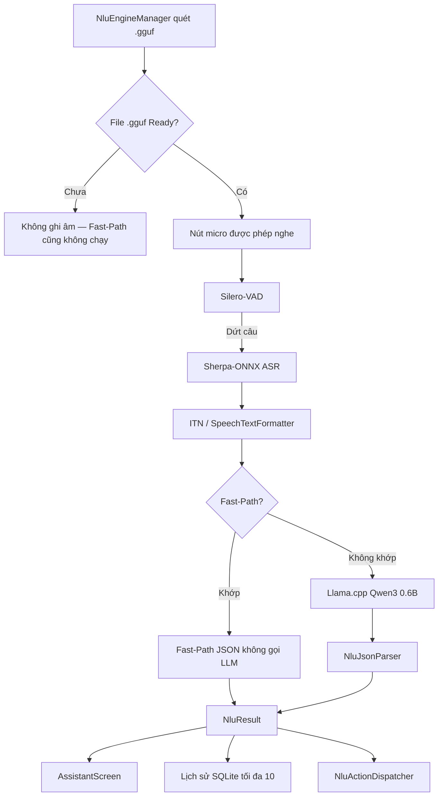

# 🎙️ ViDroidCall — Trợ lý giọng nói tiếng Việt (Hybrid On-Device NLU)

<p align="center">
  
</p>

<p align="center">
  <b>ViDroidCall giúp người lớn tuổi thao tác điện thoại bằng giọng nói tiếng Việt: gọi điện, nhắn tin, mở ứng dụng, hẹn giờ / báo thức, chỉ đường, tìm video, phát nhạc và tra cứu thông tin trên web. Giao diện nút lớn, hướng dẫn bằng giọng nói, xác nhận trước thao tác có rủi ro. Nghe lệnh và hiểu ý định chạy trên máy; bản đồ, video và tìm web mở ứng dụng hệ thống (có thể cần mạng).</b>
</p>

<p align="center">
  
  
  
  
  
  
  
  
  <a href="LICENSE"></a>
  <a href="https://huggingface.co/tuanhdev/vidroidcall-qwen3-0.6B-nlu-gguf-v6"></a>
</p>

---

## 📖 Giới thiệu

**ViDroidCall Studio** (sản phẩm **ViDroidCall**) là ứng dụng Android trợ lý giọng nói tiếng Việt, kiến trúc **Hybrid NLU**:

1. **Nạp GGUF** — chưa có file `.gguf` thì **không ghi âm**, Fast-Path cũng không chạy từ giọng nói.
2. **Sherpa-ONNX ASR & Silero-VAD** — nhận diện tiếng Việt trên máy (Zipformer 30M Int8), ngắt câu theo VAD, chuẩn hóa số (ITN).
3. **Fast-Path** — sau khi AI Ready: câu ngắn khớp quy tắc/regex **không gọi LLM**.
4. **On-device LLM (Llama.cpp, Qwen3 0.6B GGUF)** — khi Fast-Path không khớp.

STT và NLU **không cần internet**. Gọi / SMS / mở app / báo thức chạy local. **Chỉ đường, YouTube, tìm web** mở app hệ thống và có thể cần mạng.

Phiên bản nguồn: [GitHub Release v1.0.1](https://github.com/tuanhdevvn/ViDroidCall-Studio/releases/tag/v1.0.1) (P2 copyright header nằm trên `main`, mới hơn tag).

---

## ✨ Tính năng

### 1. Nhận dạng giọng nói ngoại tuyến (Sherpa-ONNX)
* Zipformer 30M Int8 tiếng Việt trên thiết bị.
* Silero-VAD: lọc ồn, ngắt câu sau khoảng lặng.
* Chuẩn hóa số (*"không chín một hai…"* → *"0912…"*, *"sáu giờ rưỡi"* → *"6:30"*).
* Hiển thị: Sherpa thường ra IN HOA → `SpeechTextFormatter` đưa về chữ thường, hoa đầu câu.

### 2. Hộp thoại giọng nói 4 giai đoạn
* **Chờ nói:** `Hãy nói gì đó...`
* **Đang nói:** VAD bắt tiếng → `Đang lắng nghe câu lệnh...`
* **Nói xong:** in câu STT (ví dụ `Gọi cho mẹ`).
* **Phân tích:** `AI đang phân tích câu lệnh...` → thực thi + TTS.

Nghe bằng **nút Micro trên màn trợ lý**. Logo giữa menu bar chỉ về tab Home / Hỏi đáp.

### 3. Fast-Path (không LLM, chỉ khi đã nạp GGUF)
* Micro / STT tắt cho đến khi huy hiệu **Trợ lý AI đã sẵn sàng**.
* Khi Ready: quy tắc `assets/fast_path_rules.json` + regex trong `FastPathMatcher` — **không gọi Llama.cpp**.
* Huy hiệu: `⚡ Fast-Path` hoặc `🧠 On-Device AI (GGUF)`.

### 4. Quyền & an toàn
* Hướng dẫn 3 bước (không nút “cấp quyền ngay” dễ treo): Micro, Danh bạ, Bộ nhớ.
* Xác nhận trước gọi / SMS và thao tác rủi ro khác.
* Cỡ chữ hệ thống (font scale), theme sáng/tối.

### 5. Debounce
* Chống spam micro / hủy nghe; chạy lại cùng một câu lệnh không bị nuốt.

### 6. Intent hỗ trợ

| Intent | Phân loại | Mô tả | Tham số |
| :--- | :--- | :--- | :--- |
| `greeting` | Fast-Path | Chào hỏi | — |
| `goodbye` | Fast-Path | Tạm biệt | — |
| `call_contact` | Hybrid | Gọi theo tên / số / 113–115 | `contact`, `phone_number` |
| `send_sms` | Hybrid | Soạn SMS | `contact`, `phone_number`, `message` |
| `set_alarm` | Hybrid | Báo thức | `hour`, `minute`, `label` |
| `set_timer` | Hybrid | Hẹn giờ | `duration`, `unit`, `label` |
| `open_map` | Hybrid | Chỉ đường (cần mạng khi mở bản đồ) | `destination` |
| `open_app` | Hybrid | Mở app đã cài | `app_name` |
| `search_video` | Hybrid | Tìm video YouTube | `query` |
| `play_music` | Hybrid | Phát nhạc | `song_name` / `genre` |
| `search_web` | Hybrid | Tra cứu web (Google / `ACTION_WEB_SEARCH`, cần mạng) | `query` |
| `clarify` | Hybrid | Thiếu slot, hỏi lại | `missing` |
| `unsupported` | Hybrid | Ngoài phạm vi | — |

`search_web`: thời tiết, “là ai / là gì”, tin tức, phép tính đơn giản. Không nhầm với `open_map` (quán gần tôi), `search_video` (YouTube), `call_contact` (gọi cho…). Thiếu nội dung → `clarify` (`missing: ["query"]`), không mở URL rỗng. Không hộp xác nhận khi search.

---

## 🏗️ Kiến trúc



---

## 📁 Cấu trúc mã (rút gọn)

```text
com.example.ViDroidCall_Studio/
├── MainActivity.kt
├── data/local/          # history SQLite, theme, font, onboarding, feedback JSONL
├── data/model/          # NluIntent, NluResult, parser
├── data/nlu/            # FastPathMatcher, NluEngineManager, dispatcher, NluConstants
├── domain/model/        # NativeAction (gọi, SMS, web, …)
├── feature/assistant|history|home|onboarding|settings|speech
├── ui/component         # menu bar (nút giữa = về Home), dialog quyền
└── util/                # ContactResolver, AppResolver, StoragePermissionHelper
assets/fast_path_rules.json
assets/sherpa-onnx-vi/
```

Chi tiết file: xem cây trong IDE. `SpeechTextFormatter.kt` — casing STT. `TimeProvider.kt` — giờ cho báo thức.

---

## 🚀 Cài đặt & nạp GGUF

[docs/BUILD.md](docs/BUILD.md) · [CONTRIBUTING.md](CONTRIBUTING.md) · [Issues](https://github.com/tuanhdevvn/ViDroidCall-Studio/issues) · [CHANGELOG.md](CHANGELOG.md)

**Micro chỉ nghe** khi huy hiệu **Trợ lý AI đã sẵn sàng** (đã nạp `.gguf` trong Download). Chưa có file: bấm mic được nhưng **không ghi âm** — **Fast-Path cũng không chạy** (không có câu STT).

Sau khi Ready, câu ngắn đi **Fast-Path** (không Llama.cpp). LLM chỉ khi không khớp Fast-Path.

### Biên dịch

JDK **21**, `compileSdk` 37 / `minSdk` 26. Android Studio không bắt buộc.

```bash
git clone https://github.com/tuanhdevvn/ViDroidCall-Studio.git
cd ViDroidCall-Studio
./gradlew assembleDebug
./gradlew installDebug   # tuỳ chọn, máy đã bật USB debug
```

APK: `app/build/outputs/apk/debug/app-debug.apk`.

### Nạp Qwen3 GGUF

[tuanhdev/vidroidcall-qwen3-0.6B-nlu-gguf-v6](https://huggingface.co/tuanhdev/vidroidcall-qwen3-0.6B-nlu-gguf-v6) — `qwen3-nlu-run-006-Q4_K_M.gguf` (~397 MB). **Không** nằm trong Git.

```bash
adb push ~/Downloads/qwen3-nlu-run-006-Q4_K_M.gguf /sdcard/Download/
```

Cấp quyền tệp nếu hệ thống hỏi. Huy hiệu xanh → micro bắt đầu nghe.

---

## 🛡️ CI

GitHub Actions: phụ thuộc Gradle, `compileDebugKotlin`, `testDebugUnitTest`, quét classpath.

```bash
./gradlew testDebugUnitTest
```

---

## 📄 Giấy phép

[Apache License 2.0](https://www.apache.org/licenses/LICENSE-2.0). File Kotlin của nhóm: `SPDX-License-Identifier: Apache-2.0` và `Copyright 2026 ViDroidCall Studio contributors`.

```text
Copyright 2026 ViDroidCall Studio contributors

Licensed under the Apache License, Version 2.0
http://www.apache.org/licenses/LICENSE-2.0
```

* [LICENSE](LICENSE) · [NOTICE](NOTICE) (có attribution Qwen3 / Alibaba)
* Bên thứ ba: [OPEN_SOURCE_LICENSES.md](OPEN_SOURCE_LICENSES.md)
* `.so` / Zipformer không sửa: [docs/THIRD_PARTY_BINARIES.md](docs/THIRD_PARTY_BINARIES.md)
* GGUF: [Hugging Face Qwen3 0.6B run-006](https://huggingface.co/tuanhdev/vidroidcall-qwen3-0.6B-nlu-gguf-v6)
* Repo: [tuanhdevvn/ViDroidCall-Studio](https://github.com/tuanhdevvn/ViDroidCall-Studio)
