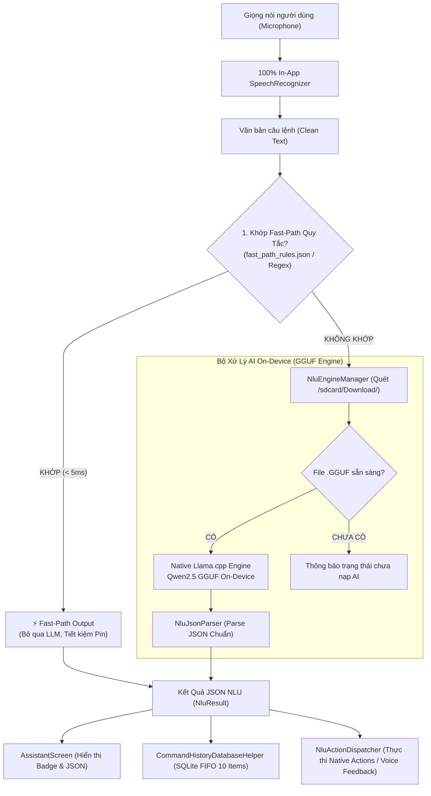

# 🎙️ ViDroidCall Studio - Trợ Lý Giọng Nói Tiếng Việt & Hybrid On-Device NLU

<p align="center">
  
</p>

<p align="center">
  <b>Trợ lý ảo điều khiển giọng nói tiếng Việt thông minh với kiến trúc Hybrid NLU: Bộ quy tắc Fast-Path phản hồi tức thì (< 5ms) kết hợp mô hình AI On-Device (GGUF Llama.cpp) chạy 100% ngoại tuyến, giao diện Jetpack Compose trực quan, tối ưu cho mọi lứa tuổi và người cao tuổi.</b>
</p>

<p align="center">
  
  
  
  
  
  
  
  
</p>

---

## 📖 Giới Thiệu (Overview)

**ViDroidCall Studio** là ứng dụng trợ lý giọng nói tiếng Việt thế hệ mới, hoạt động hoàn toàn ngoại tuyến (**100% Offline**). Ứng dụng tiên phong áp dụng kiến trúc **Hybrid NLU**:
1. **Fast-Path Engine (< 5ms)**: Xử lý tức thì các câu lệnh ngắn, cố định và chào hỏi/tạm biệt từ bộ dữ liệu chuẩn mà **không cần đánh thức mô hình AI**, tiết kiệm tối đa PIN và tài nguyên RAM/CPU.
2. **On-Device LLM (Llama.cpp GGUF)**: Tự động tiếp nhận và suy luận thông minh khi gặp các câu lệnh tự nhiên, phức tạp hoặc đa dạng ngữ cảnh.

---

## ✨ Tính Năng Nổi Bật (Key Features)

### 1. ⚡ Bộ Định Tuyến Nhanh Fast-Path (Zero-LLM Latency)
* **Phản hồi tức thì**: Độ trễ xử lý dưới **5ms** đối với các câu lệnh phổ biến (chào hỏi, báo thức, hẹn giờ, mở app, gọi điện khẩn cấp,...).
* **Bộ dữ liệu quy tắc `fast_path_rules.json`**: Lưu trữ trong `assets`, hỗ trợ chuẩn hóa tiếng Việt, khớp từ khóa chính xác và trích xuất tham số bằng Regex linh hoạt.
* **Huy hiệu phân biệt nguồn**: Hiển thị rõ ràng trên giao diện nguồn xử lý: `⚡ Fast-Path (Bộ dữ liệu)` hoặc `🧠 On-Device AI (GGUF)`.

### 2. 🤖 Động Cơ AI NLU Cục Bộ (On-Device GGUF Engine)
* **Native Offline GGUF Engine**: Tự động quét và nạp file mô hình AI (`.gguf`) trực tiếp từ **thư mục Download (`/sdcard/Download/`)**, chạy suy luận cục bộ bảo mật qua `LlamaHelper` (llama.cpp C++ JNI).
* **Kiểm soát an toàn & Làm mờ trạng thái (Safe Dimming & Guard)**: Khi AI đang nạp hoặc chưa có mô hình, các nút chức năng sẽ tự động làm mờ và bảo vệ hệ thống.
* **Badge trạng thái tinh gọn**: Màn hình chính hiển thị trực quan (`🟢 Trợ lý AI đã sẵn sàng`, `🟡 Đang nạp...`, `🔴 Chưa có mô hình AI`).

### 3. 🎙️ Nhận Dạng Giọng Nói Thuần Trong App (100% In-App Speech)
* Chạy trực tiếp qua `SpeechRecognizer` nội bộ trên `MainLooper`, **không mở popup Google**, bảo đảm luồng trải nghiệm liền mạch và an toàn luồng (Thread-safe).
* **Hiệu ứng sóng âm lan tỏa (Voice Rings)**: Chuyển động nhịp nhàng theo giọng nói và tự động chuyển sang vòng xoay phân tích khi xử lý câu lệnh.

### 4. ⚡ 10 Nhóm Ý Định & Hành Động Chuẩn (Standard Intents)

| Intent | Phân loại | Mô Tả | Tham Số Trích Xuất |
| :--- | :--- | :--- | :--- |
| `greeting` | **Fast-Path** | Chào hỏi thân thiện (*"Xin chào"*, *"Hello"*, *"Chào bạn"*) | — |
| `goodbye` | **Fast-Path** | Tạm biệt, kết thúc (*"Tạm biệt"*, *"Bye"*, *"Hẹn gặp lại"*) | — |
| `call_contact` | **Hybrid** | Gọi điện thoại / Cuộc gọi khẩn cấp (113, 114, 115) | `contact` |
| `send_sms` | **Hybrid** | Soạn và gửi tin nhắn SMS | `contact`, `message` |
| `set_alarm` | **Hybrid** | Cài đặt chuông báo thức | `hour`, `minute`, `label` |
| `set_timer` | **Hybrid** | Hẹn giờ đếm ngược | `duration`, `unit`, `label` |
| `open_map` | **Hybrid** | Mở bản đồ / Chỉ đường điểm đến | `destination` |
| `open_app` | **Hybrid** | Khởi chạy ứng dụng cài sẵn (Youtube, Zalo, FB,...) | `app_name` |
| `clarify` | **Hybrid** | Yêu cầu người dùng bổ sung thông tin khi thiếu dữ liệu | `missing` |
| `unsupported`| **Hybrid** | Phản hồi khi câu lệnh nằm ngoài phạm vi hỗ trợ | — |

### 5. 📜 Quản Lý Lịch Sử Câu Lệnh (Tối Đa 10 Câu Lệnh Mới Nhất)
* Lưu trữ cơ sở dữ liệu SQLite ngoại tuyến: Tự động giữ **tối đa 10 câu lệnh gần nhất** (tự động dọn dẹp theo cơ chế FIFO).
* Hỗ trợ chạy lại câu lệnh (Rerun), xóa từng câu lệnh và **Xóa tất cả (Clear All)** có hộp thoại xác nhận an toàn.

### 6. 👓 Tùy Chỉnh Cỡ Chữ Chuẩn Xác (Pixel-Perfect Font Slider)
* Thanh trượt điều chỉnh tỷ lệ chữ (`85%` đến `135%`) với 4 nấc chọn nhanh (`Nhỏ` • `Vừa` • `Lớn` • `Rất lớn`).
* Áp dụng tức thời trên toàn bộ ứng dụng qua `CompositionLocalProvider(LocalDensity)`.

---

## 🏗️ Kiến Trúc Hệ Thống (System Architecture)



---

## 📁 Cấu Trúc Thư Mục (Project Structure)

```text
com.example.ViDroidCall_Studio/
│
├── MainActivity.kt                      # Activity gốc, khởi tạo Theme và Font Scale toàn cục
│
├── data/
│   ├── local/
│   │   ├── history/
│   │   │   ├── CommandHistoryDatabaseHelper.kt # SQLite Helper (Giới hạn tối đa 10 bản ghi)
│   │   │   └── CommandHistoryRepository.kt     # Repository CRUD và reactive Flow
│   │   ├── FontSizePreferences.kt       # Lưu trữ cấu hình cỡ chữ vào DataStore
│   │   ├── OnboardingPreferences.kt     # Lưu trạng thái Onboarding
│   │   └── ThemePreferences.kt          # Lưu cấu hình Theme (Light / Dark / System)
│   │
│   ├── model/
│   │   ├── NluModels.kt                 # Model NluIntent (10 Intent), NluStatus, NluResult
│   │   └── NluJsonParser.kt             # Phân tích cú pháp JSON an toàn
│   │
│   └── nlu/
│       ├── FastPathMatcher.kt           # Bộ lọc quy tắc & Regex Fast-Path (< 5ms)
│       ├── NluEngineManager.kt          # Quản lý Hybrid NLU & Nạp file GGUF On-Device
│       ├── NluActionDispatcher.kt       # Điều phối hành động Android (Gọi, SMS, App, Báo thức)
│       └── NluConstants.kt              # ChatML Prompt Template & Cấu hình Model
│
├── feature/
│   ├── assistant/
│   │   └── AssistantScreen.kt           # Màn hình chính Micro, Badge trạng thái & Thẻ JSON
│   ├── history/
│   │   ├── HistoryScreen.kt             # Màn hình Lịch sử câu lệnh
│   │   └── model/
│   │       └── CommandHistoryItem.kt    # Model dữ liệu lịch sử
│   ├── home/
│   │   └── HomeScreen.kt                # Màn hình điều hướng tab chính
│   ├── onboarding/
│   │   └── OnbroadingScreen.kt          # Màn hình giới thiệu ban đầu
│   ├── settings/
│   │   ├── SettingsScreen.kt            # Cài đặt Theme, Cỡ chữ & Thẻ thông tin Model AI
│   │   ├── FontSizeSettingsScreen.kt    # Màn hình chỉnh cỡ chữ chuyên sâu
│   │   └── ThemeSelectionScreen.kt      # Màn hình chọn Theme
│   └── speech/
│       ├── RememberSpeechToText.kt      # Compose hook quản lý nhận diện giọng nói
│       └── SpeechToTextManager.kt       # Quản lý SpeechRecognizer chạy ngầm 100% In-App
│
├── assets/
│   └── fast_path_rules.json             # Bộ dữ liệu mẫu câu lệnh ngắn gọn Fast-Path
│
└── navigation/
    ├── AppNavHost.kt                    # Điều hướng Onboarding ↔ Home
    ├── AppRoot.kt                       # Kiểm tra trạng thái khởi chạy
    └── AppRoute.kt                      # Định nghĩa các Route
```

---

## 🚀 Hướng Dẫn Cài Đặt & Nạp Mô Hình AI

### 1. Biên dịch và cài đặt APK lên thiết bị
```bash
# 1. Clone repository
git clone https://github.com/tuanhdevvn/Emma-ViDroidCall.git
cd Emma-ViDroidCall

# 2. Cài đặt trực tiếp lên điện thoại đang kết nối qua ADB
./gradlew installDebug
```

### 2. Nạp file mô hình AI GGUF vào điện thoại
Ứng dụng tự động quét file `.gguf` tại **thư mục Download**:

```bash
# Nạp file model vào thư mục Download của điện thoại
adb push /path/to/qwen2.5-0.5b-nlu-q8_0.gguf /sdcard/Download/
```

Sau khi nạp file vào `/sdcard/Download/`:
* Màn hình chính hiển thị huy hiệu: **`🟢 Trợ lý AI đã sẵn sàng`**.
* Các câu lệnh ngắn sẽ được xử lý tức thì qua **`⚡ Fast-Path`**, các câu lệnh phức tạp sẽ được phân tích trực tiếp qua **`🧠 On-Device AI`**.

---

## 📄 Bản Quyền & Tác Giả (License)

Dự án được xây dựng và phát triển bởi **Tuấn Anh** ([@tuanhdevvn](https://github.com/tuanhdevvn)). Mọi quyền được bảo lưu.
