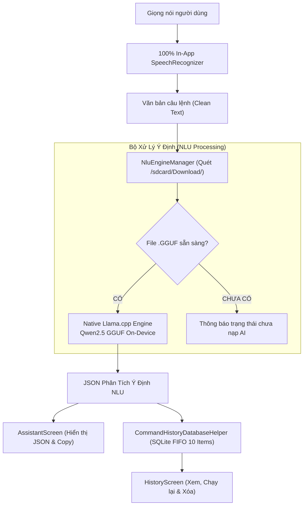

# 🎙️ ViDroidCall Studio - Trợ Lý Giọng Nói Tiếng Việt & On-Device AI NLU

<p align="center">
  
</p>

<p align="center">
  <b>Trợ lý ảo ra lệnh giọng nói tiếng Việt thông minh, tích hợp mô hình AI NLU (Natural Language Understanding) chạy 100% Offline On-Device (GGUF LLM), giao diện Jetpack Compose trực quan, dễ dùng cho mọi lứa tuổi và người cao tuổi.</b>
</p>

<p align="center">
  
  
  
  
  
  
  
</p>

---

## 📖 Giới Thiệu (Overview)

**ViDroidCall Studio** là ứng dụng trợ lý điều khiển điện thoại bằng giọng nói tiếng Việt thế hệ mới. Ứng dụng tích hợp công nghệ nhận diện giọng nói thuần nội bộ (**100% In-App SpeechRecognizer**) và bộ xử lý ngôn ngữ tự nhiên **NLU AI chạy On-Device (GGUF Offline)**, cho phép người dùng điều khiển các chức năng trên điện thoại nhanh chóng, bảo mật tuyệt đối và không phụ thuộc vào kết nối mạng.

Giao diện được thiết kế theo phong cách **Material Design 3** tối giản, tone màu xanh thương hiệu đồng nhất, cỡ chữ lớn dễ đọc, đặc biệt tối ưu cho **người lớn tuổi và người cần trợ năng**.

---

## ✨ Tính Năng Nổi Bật (Key Features)

### 1. 🤖 Động Cơ AI NLU Chạy Cục Bộ (On-Device GGUF Engine)
* **Native Offline GGUF Engine**: Tự động quét và nạp file mô hình AI (`.gguf`) trực tiếp từ **thư mục Download (`/sdcard/Download/`)**, chạy suy luận cục bộ bảo mật qua `LlamaHelper` (llama.cpp C++ JNI).
* **Kiểm soát an toàn & Làm mờ trạng thái (Safe Dimming & Guard)**: Khi AI đang nạp hoặc chưa có mô hình, các nút chức năng sẽ tự động làm mờ sang màu xanh dịu và vô hiệu hóa thao tác để bảo vệ hệ thống.
* **Badge trạng thái tinh gọn**: Màn hình chính hiển thị ngắn gọn (`🟢 Trợ lý AI đã sẵn sàng`, `🟡 Đang nạp...`, `🔴 Chưa có mô hình AI`). Toàn bộ tên file chi tiết được hiển thị riêng biệt trong tab Cài đặt.

### 2. 🎙️ Nhận Dạng Giọng Nói Thuần Trong App (100% In-App Speech)
* Chạy trực tiếp qua `SpeechRecognizer` nội bộ trên `MainLooper`, **không mở bất kỳ popup ngoài của Google**, đem lại trải nghiệm liền mạch.
* Hiệu ứng sóng âm lan tỏa liên tục quanh nút Micro ở trạng thái chờ và chuyển động theo giọng nói.
* **Hiệu ứng phân tích AI sống động**: Khi nói xong, icon chuyển sang vòng xoay phân tích AI (Loading Spinner + AutoAwesome) và tự động trở lại bình thường khi xuất kết quả.

### 3. ⚡ 8 Nhóm Ý Định & Hành Động Chuẩn (Standard Intents)
| Intent | Mô Tả | Tham Số Trích Xuất |
| :--- | :--- | :--- |
| `call_contact` | Gọi điện thoại / Cuộc gọi khẩn cấp (113, 114, 115) | `contact` |
| `send_sms` | Soạn và gửi tin nhắn SMS | `contact`, `message` |
| `set_alarm` | Cài đặt chuông báo thức | `hour`, `minute`, `label` |
| `set_timer` | Hẹn giờ đếm ngược | `duration`, `unit`, `label` |
| `open_map` | Mở bản đồ / Chỉ đường điểm đến | `destination` |
| `open_app` | Khởi chạy ứng dụng cài sẵn | `app_name` |
| `clarify` | Yêu cầu người dùng bổ sung thông tin khi thiếu dữ liệu | `missing` |
| `unsupported`| Phản hồi khi câu lệnh nằm ngoài phạm vi | — |

### 4. 📜 Quản Lý Lịch Sử Câu Lệnh (Tối Đa 10 Câu Lệnh Mới Nhất)
* Lưu trữ cơ sở dữ liệu SQLite ngoại tuyến: Tự động giữ **tối đa 10 câu lệnh gần nhất** (tự động dọn dẹp câu lệnh cũ nhất theo cơ chế FIFO).
* Hỗ trợ chạy lại câu lệnh (Rerun), xóa từng câu lệnh và **Xóa tất cả (Clear All)** có hộp thoại xác nhận an toàn.

### 5. 👓 Tùy Chỉnh Cỡ Chữ Chuẩn Xác (Pixel-Perfect Font Slider)
* Thanh trượt điều chỉnh tỷ lệ chữ (`85%` đến `135%`) với 4 nấc chọn nhanh (`Nhỏ` • `Vừa` • `Lớn` • `Rất lớn`).
* Tọa độ các mốc được tính toán chuẩn xác theo quỹ đạo `thumbRadius`, không bị lồi hay tràn mép ngoài.
* Áp dụng tức thời trên toàn bộ ứng dụng qua `CompositionLocalProvider(LocalDensity)`.

---

## 🏗️ Kiến Trúc Hệ Thống (System Architecture)



---

## 📁 Cấu Trúc Thư Mục (Project Structure)

```text
com.example.ViDroidCall_Studio/
│
├── MainActivity.kt                      # Activity gốc, khởi tạo Theme và Font Scale toàn cục
│
├── data/
│   ├── local/
│   │   ├── history/
│   │   │   ├── CommandHistoryDatabaseHelper.kt # SQLite Helper (Giới hạn tối đa 10 bản ghi)
│   │   │   └── CommandHistoryRepository.kt     # Repository CRUD và reactive Flow
│   │   ├── FontSizePreferences.kt       # Lưu trữ cấu hình cỡ chữ vào DataStore
│   │   ├── OnboardingPreferences.kt     # Lưu trạng thái Onboarding
│   │   └── ThemePreferences.kt          # Lưu cấu hình Theme (Light / Dark / System)
│   │
│   ├── model/
│   │   ├── NluModels.kt                 # Model dữ liệu NluIntent, NluSlot, NluResult
│   │   └── NluJsonParser.kt             # Phân tích cú pháp JSON an toàn
│   │
│   └── nlu/
│       ├── NluEngineManager.kt          # Bộ nạp & quét mô hình AI trong /sdcard/Download/
│       ├── NluActionDispatcher.kt       # Điều phối hành động Android
│       └── NluConstants.kt              # ChatML Prompt Template
│
├── feature/
│   ├── assistant/
│   │   └── AssistantScreen.kt           # Màn hình chính Micro, Badge & Thẻ JSON
│   ├── history/
│   │   ├── HistoryScreen.kt             # Màn hình Lịch sử câu lệnh
│   │   └── model/
│   │       └── CommandHistoryItem.kt    # Model dữ liệu lịch sử
│   ├── home/
│   │   └── HomeScreen.kt                # Màn hình điều hướng tab chính
│   ├── onboarding/
│   │   └── OnbroadingScreen.kt          # Màn hình giới thiệu ban đầu
│   ├── settings/
│   │   ├── SettingsScreen.kt            # Cài đặt Theme, Cỡ chữ & Thẻ thông tin Model AI
│   │   ├── FontSizeSettingsScreen.kt    # Màn hình chỉnh cỡ chữ chuyên sâu
│   │   └── ThemeSelectionScreen.kt      # Màn hình chọn Theme
│   └── speech/
│       ├── RememberSpeechToText.kt      # Compose hook quản lý nhận diện giọng nói
│       └── SpeechToTextManager.kt       # Quản lý SpeechRecognizer chạy ngầm 100% In-App
│
├── navigation/
│   ├── AppNavHost.kt                    # Điều hướng Onboarding ↔ Home
│   ├── AppRoot.kt                       # Kiểm tra trạng thái khởi chạy
│   └── AppRoute.kt                      # Định nghĩa các Route
│
└── ui/
    ├── component/
    │   ├── CustomBottomMenuBar.kt       # Thanh Bottom Bar với Logo App trung tâm
    │   └── BounceClickModifier.kt       # Hiệu ứng chạm phản hồi xúc giác
    └── theme/
        ├── Color.kt                     # Bảng màu chuẩn thương hiệu
        ├── Shape.kt                     # Cấu hình bo góc
        ├── Theme.kt                     # ViDroidCallTheme hỗ trợ Dynamic Font Scale
        └── Type.kt                      # Typography chuẩn Material 3
```

---

## 🚀 Hướng Dẫn Cài Đặt & Nạp Mô Hình AI

### 1. Biên dịch và cài đặt APK
```bash
# 1. Clone repository
git clone https://github.com/tuanhdevvn/ViDroidCall-Studio.git
cd ViDroidCall-Studio

# 2. Biên dịch APK Debug
./gradlew assembleDebug
```

### 2. Nạp file mô hình AI GGUF vào điện thoại
Ứng dụng được cấu hình tự động quét file `.gguf` tại **thư mục Download**:

```bash
# Nạp file model vào thư mục Download của điện thoại
adb push /path/to/qwen2.5-0.5b-instruct-q4_k_m_1.gguf /sdcard/Download/
```

Sau khi nạp file vào `/sdcard/Download/`, mở ứng dụng **ViDroidCall Studio**:
* Huy hiệu trên cùng sẽ hiển thị: **`🟢 Trợ lý AI đã sẵn sàng`**.
* Vào tab **Cài đặt** $\rightarrow$ Thẻ **Mô hình AI** sẽ hiển thị đầy đủ tên model đang hoạt động.

---

## 📄 Bản Quyền & Tác Giả (License)

Dự án được xây dựng và phát triển bởi **Tuấn Anh** ([@tuanhdevvn](https://github.com/tuanhdevvn)). Mọi quyền được bảo lưu.
