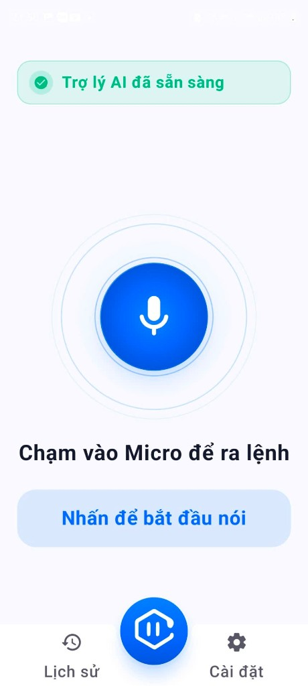
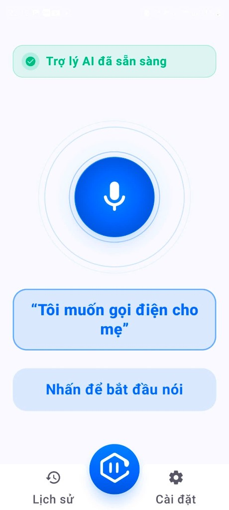
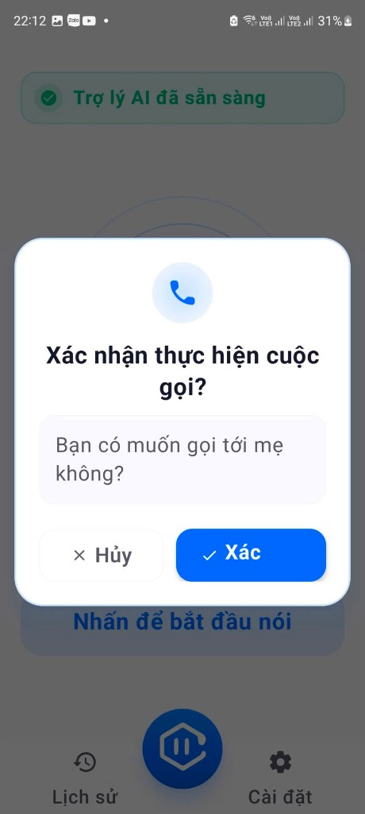
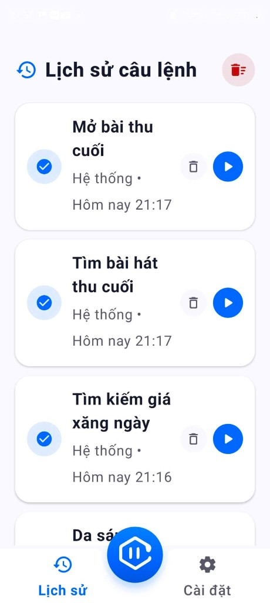
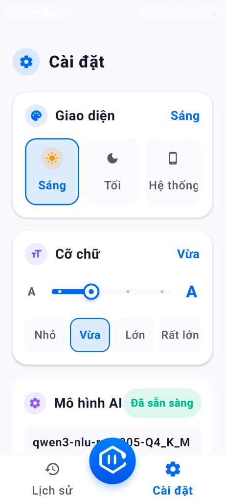
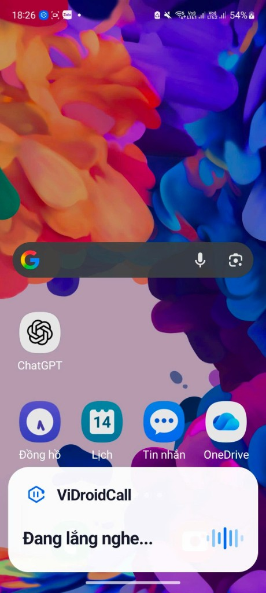
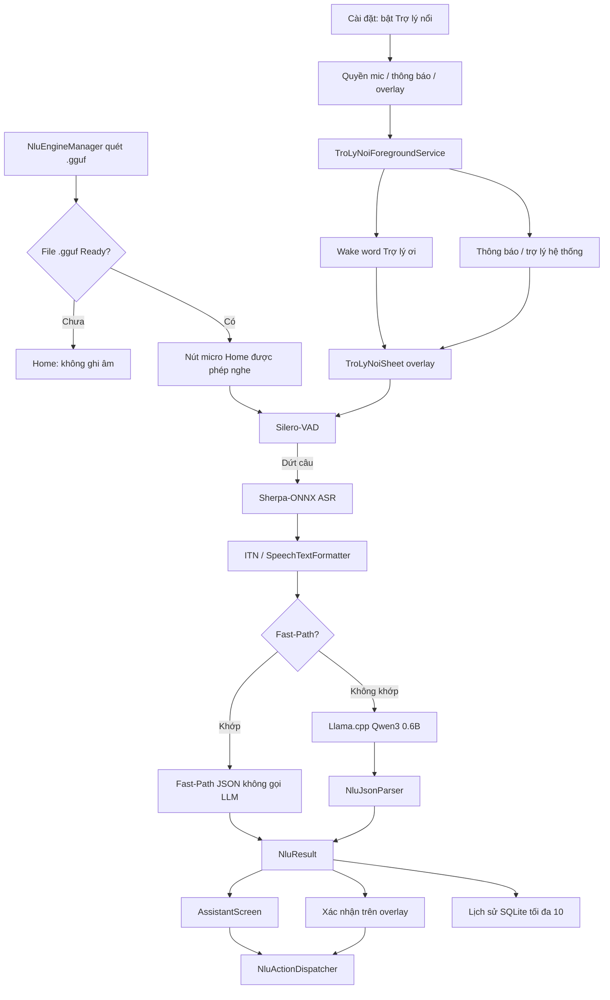

# 🎙️ ViDroidCall — Trợ lý giọng nói tiếng Việt (Hybrid On-Device NLU)

<p align="center">
  
</p>

<p align="center">
  <b>ViDroidCall giúp người lớn tuổi thao tác điện thoại bằng giọng nói tiếng Việt: gọi điện, nhắn tin, mở ứng dụng, hẹn giờ / báo thức, chỉ đường, tìm video, phát nhạc và tra cứu thông tin trên web. Giao diện nút lớn, hướng dẫn bằng giọng nói, xác nhận trước thao tác có rủi ro. Có thể ra lệnh trong app hoặc bật <i>Trợ lý nổi</i> để nói “Trợ lý ơi” khi đang dùng ứng dụng khác. Nghe lệnh và hiểu ý định chạy trên máy; bản đồ, video và tìm web mở ứng dụng hệ thống (có thể cần mạng).</b>
</p>

<p align="center">
  
  
  
  
  
  
  
  
  
  <a href="LICENSE"></a>
  <a href="models/README.md"></a>
</p>

---

## 📖 Giới thiệu

**ViDroidCall Studio** (sản phẩm **ViDroidCall**) là ứng dụng Android trợ lý giọng nói tiếng Việt, kiến trúc **Hybrid NLU**:

1. **Nạp GGUF** — chưa có file `.gguf` thì **nút micro trên màn trợ lý không ghi âm**. Fast-Path từ giọng nói trong app cũng không chạy.
2. **Sherpa-ONNX ASR & Silero-VAD** — nhận diện tiếng Việt trên máy (Zipformer 30M Int8), ngắt câu theo VAD, chuẩn hóa số (ITN).
3. **Fast-Path** — sau khi AI Ready: câu ngắn khớp quy tắc/regex **không gọi LLM**.
4. **On-device LLM (Llama.cpp, Qwen3 0.6B GGUF)** — khi Fast-Path không khớp.
5. **Trợ lý nổi** (mặc định tắt) — hộp thoại đè lên app khác; nói **“Trợ lý ơi”** / **“Trợ lý”**, hoặc chạm thông báo / nút **Nói câu lệnh**.

STT và NLU **không cần internet**. Gọi / SMS / mở app / báo thức chạy local. **Chỉ đường, YouTube, tìm web** mở app hệ thống và có thể cần mạng.

Phiên bản nguồn: [GitHub Release v1.1.1](https://github.com/tuanhdevvn/ViDroidCall-Studio/releases/tag/v1.1.1).

---

## Giao diện

<p align="center">
  
  
  
</p>
<p align="center">
  
  
  
</p>

<p align="center">
  <sub>Home · Câu lệnh · Xác nhận gọi · Lịch sử · Cài đặt · Trợ lý nổi (công tắc Trợ lý nổi nằm dưới thẻ mô hình AI)</sub>
</p>

Hai cách ra lệnh:

| Cách | Khi nào dùng |
| :--- | :--- |
| **Nút micro trên tab Home** | Đang mở ViDroidCall |
| **Trợ lý nổi** | Đang dùng app khác: nói “Trợ lý ơi”, chạm thông báo, hoặc phím/cử chỉ trợ lý hệ thống |

---

## ✨ Tính năng

### 1. Nhận dạng giọng nói ngoại tuyến (Sherpa-ONNX)
* Zipformer 30M Int8 tiếng Việt trên thiết bị.
* Silero-VAD: lọc ồn, ngắt câu sau khoảng lặng.
* Chuẩn hóa số (*"không chín một hai…"* → *"0912…"*, *"sáu giờ rưỡi"* → *"6:30"*).
* Hiển thị: Sherpa thường ra IN HOA → `SpeechTextFormatter` đưa về chữ thường, hoa đầu câu.

### 2. Hộp thoại giọng nói trên màn trợ lý (4 giai đoạn)
* **Chờ nói:** `Hãy nói gì đó...`
* **Đang nói:** VAD bắt tiếng → `Đang lắng nghe câu lệnh...`
* **Nói xong:** in câu STT (ví dụ `Gọi cho mẹ`).
* **Phân tích:** `AI đang phân tích câu lệnh...` → thực thi + TTS.

Nghe bằng **nút Micro trên màn trợ lý**. Logo giữa menu bar chỉ về tab Home / Hỏi đáp.

### 3. Trợ lý nổi (overlay, mặc định tắt)

Công tắc **một hàng** trong Cài đặt: *Nói “Trợ lý ơi” hiện hộp thoại nổi đè lên ứng dụng khác*. Chỉ lưu bật khi đã đủ quyền, theo thứ tự:

1. Micro
2. Thông báo (Android 13+)
3. **Hiển thị trên các ứng dụng khác** (`SYSTEM_ALERT_WINDOW`)

Khi bật:

* Foreground service + thông báo *ViDroidCall: Trợ lý nổi sẵn sàng* (chạm / nút **Nói câu lệnh** để mở popup; mở Cài đặt).
* Wake word chạy nền bằng cùng engine Sherpa; **tạm dừng** khi màn hình tắt, máy khóa, hoặc overlay đang mở (tránh tranh micro).
* Hộp thoại nổi: chờ nói → câu STT → phân tích → **xác nhận mọi thao tác native** (gọi, SMS, bản đồ, app, …). Overlay **ẩn số điện thoại** (hiện tên liên hệ hoặc `****`).
* UI overlay không hiện huy hiệu kỹ thuật Fast-Path / GGUF.

Câu lệnh sau wake word vẫn Hybrid NLU. Fast-Path không cần LLM; câu phức tạp cần GGUF Ready — chưa có mô hình thì overlay báo không tìm thấy AI rồi đóng.

Từ khóa wake word (chỉ): **“Trợ lý ơi”** và **“Trợ lý”** (biến thể dấu STT: *trợ lí*). Có thể nói liền: *“Trợ lý ơi gọi cho mẹ”*. Cách khác để mở popup: **nút nhanh trên thông báo**.

### 4. Fast-Path (không LLM, chỉ khi đã nạp GGUF)
* Micro **trong app** / STT tắt cho đến khi huy hiệu **Trợ lý AI đã sẵn sàng**.
* Khi Ready: quy tắc `assets/fast_path_rules.json` + regex trong `FastPathMatcher` — **không gọi Llama.cpp**.
* Huy hiệu trên màn Home: `⚡ Fast-Path` hoặc `🧠 On-Device AI (GGUF)`.

### 5. Quyền & an toàn
* Hướng dẫn 3 bước (không nút “cấp quyền ngay” dễ treo): Micro, Danh bạ, Bộ nhớ.
* Trợ lý nổi xin thêm thông báo và hiện trên ứng dụng khác **chỉ khi bật công tắc**.
* Xác nhận trước gọi / SMS (trong app) và **mọi hành động native trên overlay**.
* Cỡ chữ hệ thống (font scale), theme sáng/tối.

### 6. Debounce
* Chống spam micro / hủy nghe; chạy lại cùng một câu lệnh không bị nuốt.

### 7. Intent hỗ trợ

| Intent | Phân loại | Mô tả | Tham số |
| :--- | :--- | :--- | :--- |
| `greeting` | Fast-Path | Chào hỏi | — |
| `goodbye` | Fast-Path | Tạm biệt | — |
| `call_contact` | Hybrid | Gọi theo tên / số / 113–115 | `contact`, `phone_number` |
| `send_sms` | Hybrid | Soạn SMS | `contact`, `phone_number`, `message` |
| `set_alarm` | Hybrid | Báo thức | `hour`, `minute`, `label` |
| `set_timer` | Hybrid | Hẹn giờ | `duration`, `unit`, `label` |
| `open_map` | Hybrid | Chỉ đường (cần mạng khi mở bản đồ) | `destination` |
| `open_app` | Hybrid | Mở app đã cài | `app_name` |
| `search_video` | Hybrid | Tìm video YouTube | `query` |
| `play_music` | Hybrid | Phát nhạc | `song_name` / `genre` |
| `search_web` | Hybrid | Tra cứu web (Google / `ACTION_WEB_SEARCH`, cần mạng) | `query` |
| `clarify` | Hybrid | Thiếu slot, hỏi lại | `missing` |
| `unsupported` | Hybrid | Ngoài phạm vi | — |

`search_web`: thời tiết, “là ai / là gì”, tin tức, phép tính đơn giản. Không nhầm với `open_map` (quán gần tôi), `search_video` (YouTube), `call_contact` (gọi cho…). Thiếu nội dung → `clarify` (`missing: ["query"]`), không mở URL rỗng. Trong app không hộp xác nhận khi search; overlay vẫn hỏi xác nhận.

---

## 🏗️ Kiến trúc



---

## 📁 Cấu trúc mã (rút gọn)

```text
com.example.ViDroidCall_Studio/
├── MainActivity.kt
├── data/local/          # history SQLite, theme, font, onboarding, TroLyNoiPreferences, feedback JSONL
├── data/model/          # NluIntent, NluResult, parser
├── data/nlu/            # FastPathMatcher, NluEngineManager, dispatcher, NluConstants
├── domain/model/        # NativeAction (gọi, SMS, web, …)
├── feature/assistant    # AssistantScreen, TroLyNoiAssistantHelper (màn hình / khóa)
├── feature/overlay      # TroLyNoiSheet, OverlayManager, WakeWord, ForegroundService
├── feature/history|home|onboarding|settings|speech
├── ui/component         # menu bar (nút giữa = về Home), dialog quyền (kể cả overlay)
└── util/                # ContactResolver, AppResolver, TroLyNoiPermissions, StoragePermissionHelper
assets/fast_path_rules.json
assets/sherpa-onnx-vi/
```

Chi tiết schema overlay / DataStore: [docs/SCHEMA.md](docs/SCHEMA.md). `SpeechTextFormatter.kt` — casing STT. `TimeProvider.kt` — giờ cho báo thức.

---

## 🚀 Cài đặt & nạp GGUF

[docs/BUILD.md](docs/BUILD.md) · [docs/SCHEMA.md](docs/SCHEMA.md) · [docs/COMMIT.md](docs/COMMIT.md) · [CONTRIBUTING.md](CONTRIBUTING.md) · [Issues](https://github.com/tuanhdevvn/ViDroidCall-Studio/issues) · [CHANGELOG.md](CHANGELOG.md)

**Micro trên Home chỉ nghe** khi huy hiệu **Trợ lý AI đã sẵn sàng** (đã nạp `.gguf` trong Download). Chưa có file: bấm mic được nhưng **không ghi âm** — **Fast-Path trong app cũng không chạy**.

Sau khi Ready, câu ngắn đi **Fast-Path** (không Llama.cpp). LLM chỉ khi không khớp Fast-Path.

### Biên dịch

JDK **21**, `compileSdk` 37 / `minSdk` 26. Android Studio không bắt buộc.

```bash
git clone https://github.com/tuanhdevvn/ViDroidCall-Studio.git
cd ViDroidCall-Studio
./gradlew assembleDebug
./gradlew installDebug   # tuỳ chọn, máy đã bật USB debug
```

APK: `app/build/outputs/apk/debug/app-debug.apk`.

### Nạp Qwen3 GGUF

Trọng số nằm trong repo: [`models/qwen3-nlu-run-Q4_K_M.gguf`](models/qwen3-nlu-run-Q4_K_M.gguf) (~397 MB, **Git LFS**). Chi tiết: [`models/README.md`](models/README.md). Cần `git lfs pull` khi clone.

Ứng dụng đọc GGUF từ thư mục **Download trên điện thoại**, không đọc từ thư mục clone:

```bash
adb push models/qwen3-nlu-run-Q4_K_M.gguf /sdcard/Download/
```

Cấp quyền tệp nếu hệ thống hỏi. Huy hiệu xanh → micro Home bắt đầu nghe.

### Bật Trợ lý nổi

1. Nạp GGUF như trên (cần cho câu không khớp Fast-Path).
2. Mở **Cài đặt** → bật **Trợ lý nổi** → cấp micro, thông báo, hiện trên ứng dụng khác.
3. Nói **“Trợ lý ơi”** khi màn hình sáng và đã mở khóa, hoặc chạm thông báo đang chạy.
4. (Tuỳ chọn) Cài đặt hệ thống → ứng dụng mặc định → trợ lý số → chọn ViDroidCall.

Tắt công tắc thì service, overlay và wake word dừng.

---

## 🛡️ CI

GitHub Actions: phụ thuộc Gradle, `compileDebugKotlin`, `testDebugUnitTest`, quét classpath.

```bash
./gradlew testDebugUnitTest
```

---

## 📄 Giấy phép

[Apache License 2.0](https://www.apache.org/licenses/LICENSE-2.0). File Kotlin của nhóm: `SPDX-License-Identifier: Apache-2.0` và `Copyright 2026 ViDroidCall Studio contributors`.

```text
Copyright 2026 ViDroidCall Studio contributors

Licensed under the Apache License, Version 2.0
http://www.apache.org/licenses/LICENSE-2.0
```

* [LICENSE](LICENSE) · [NOTICE](NOTICE) (attribution Qwen3 / Alibaba; Zipformer VI là CC BY-NC-ND 4.0)
* Bên thứ ba: [OPEN_SOURCE_LICENSES.md](OPEN_SOURCE_LICENSES.md)
* `.so` / Zipformer không sửa: [docs/THIRD_PARTY_BINARIES.md](docs/THIRD_PARTY_BINARIES.md)
* GGUF: [`models/`](models/README.md) (Git LFS)
* Repo: [tuanhdevvn/ViDroidCall-Studio](https://github.com/tuanhdevvn/ViDroidCall-Studio)
